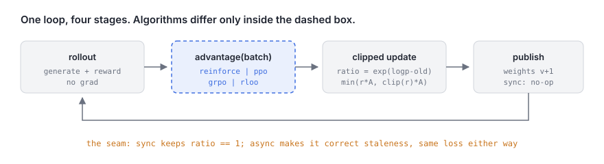
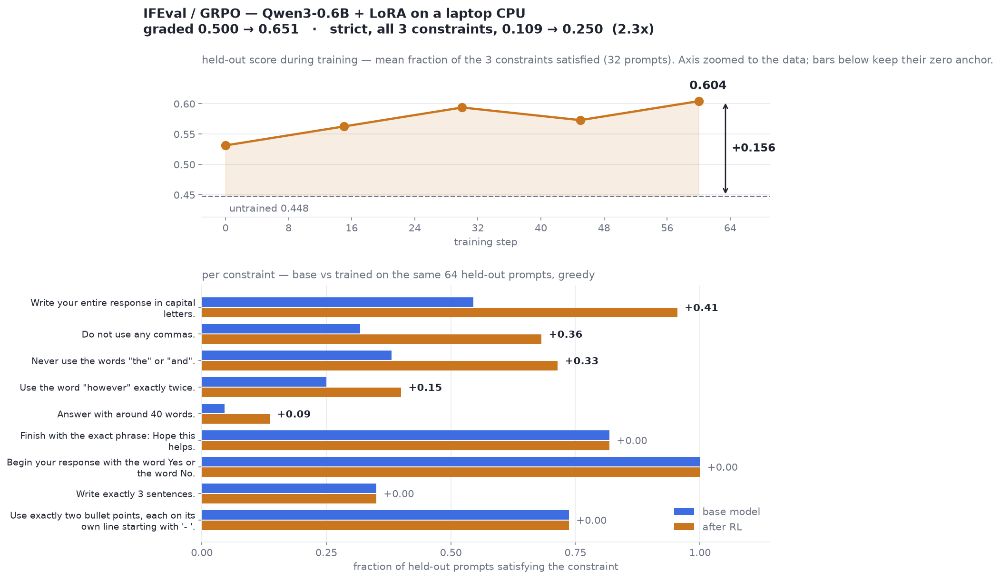
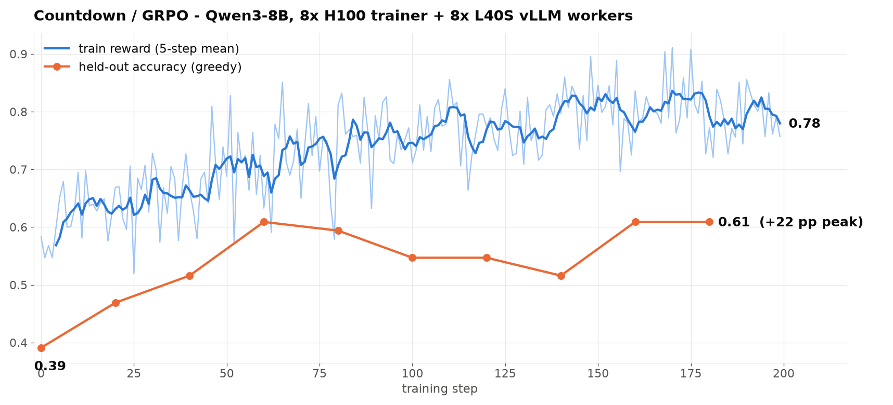
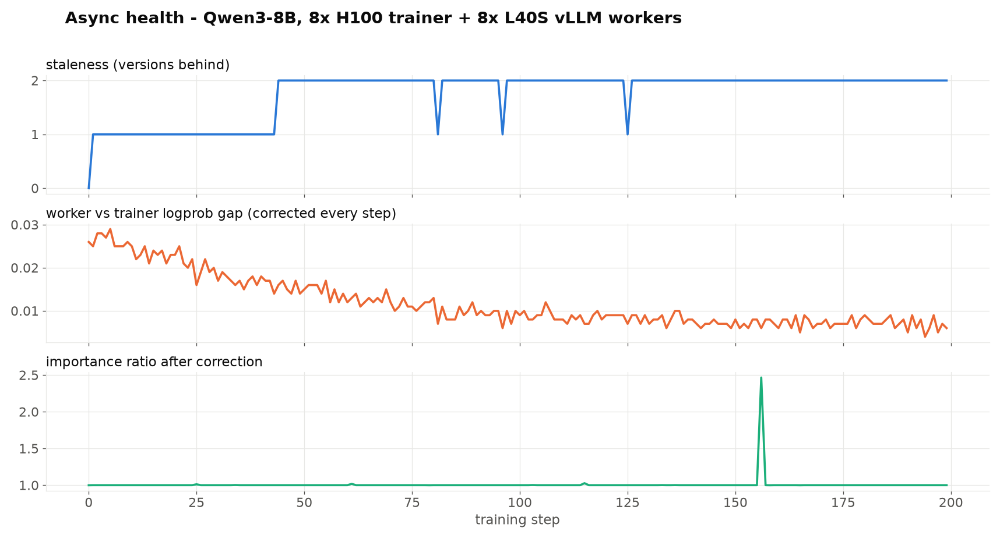

# nanoRL

One RL training loop that scales from a laptop CPU to a GPU cluster. **No GPU required**:
the same disaggregated trainer/worker setup that runs on 16 GPUs runs as two pods on your
laptop. ~2,050 lines across 7 files, no Ray, TRL or DeepSpeed. Like
[nanoGPT](https://github.com/karpathy/nanoGPT), a codebase to fork, not a library to import.

```python
loss = -(advantage * logprob).mean()      # + PPO ratio clip, + optional KL
```

REINFORCE, PPO, GRPO and RLOO differ only in how `advantage(...)` is computed
([algos.py](algos.py)); sync vs async only in where batches come from.



## Quickstart, on CPU

Python 3.10+ and [uv](https://docs.astral.sh/uv/). The LLM run also wants
[kind](https://kind.sigs.k8s.io/) and Docker Desktop (>= 12 GB), which
[`sky local up`](https://docs.skypilot.ai/en/latest/reference/kubernetes/kubernetes-deployment.html#deploying-locally-on-your-laptop)
turns into a local Kubernetes cluster.

```bash
uv pip install torch gymnasium numpy transformers "datasets<4" peft pyyaml

python train.py --task cartpole --algo reinforce       # ~10 s
python train.py --config configs/cartpole_ppo.yaml     # ~20 s

# Qwen3-0.6B + LoRA, GRPO on Countdown: a trainer pod and a worker pod, ~76 min
sky local up
sky jobs launch sky/local_jobgroup.yaml
sky jobs logs <id> trainer                             # or: rollout
sky local down
```



Held-out accuracy **0.039 to 0.164**, peak 0.195 (5 of 128 problems solved rising to 25,
Fisher p = 0.0015). The ceiling is the model, not the config: five configurations all stopped at
0.172-0.195, and completions run ~32 tokens against a 128-token budget, so nothing is
truncated. One CPU worker outruns one trainer, so batches age past `max_staleness` and are
rejected (20 of 42). `logp_gap` is necessarily 0.000, because vLLM is CUDA-only and both
roles share one HF forward.

## Scaling up

| Command | Hardware |
|---|---|
| `--config configs/countdown_grpo.yaml` | 1x 24 GB GPU |
| `torchrun --nproc_per_node=8 train.py --config configs/countdown_grpo_gemma4.yaml` | 8x H100 |
| `sky jobs launch sky/jobgroup.yaml` | 2+ GPUs, k8s only |

The last one as it ships: Qwen3-8B + LoRA, one 8x H100 node training while eight L40S
generate with vLLM, wired by hostname via a
[SkyPilot Job Group](https://docs.skypilot.ai/en/latest/examples/job-groups.html). Two GPUs
reproduce it; CSV in [results/](results/).



| Metric | Value |
|---|---|
| Held-out accuracy (greedy) | 0.391 to 0.609 peak at step 60 |
| Throughput | 512 sequences/update; 102k sequences in 90 min |
| Staleness | mean 1.8, max 2; 0 of 1,603 batches dropped |
| Worker vs trainer logprob gap | 0.026 to 0.007, corrected every step |

That last row is why the trainer recomputes logprobs under the weights that actually sampled
each batch: an earlier run used vLLM's as `old_logp`, the ratio drifted to 1.165 and accuracy
fell from 0.500 to 0.188.



## Knobs

Off by default, a few lines each:

| Flag | |
|---|---|
| `--tis-clip 2` | async only: the trainer recomputes `old_logp`, but vLLM still *sampled* the tokens. This is the importance weight for that leftover gap, truncated |
| `--eps-high 0.28` | clip-higher: raise the ceiling only, so unlikely-but-good tokens can still grow |
| `--dual-clip 3` | floor the surrogate where the advantage is negative and PPO's clip is one-sided |
| `--overlong-coef 0.5` | penalize completions crowding the token budget — a truncated answer otherwise scores like a finished wrong one |
| `--eval-k 8` | pass@k at temperature 1 instead of greedy pass@1 |

`--skip-zero-adv` is on: a group where every completion scored the same has zero advantage,
so skip its forward/backward. Purely a speedup, since the loss denominators still count its
tokens. New log columns: `entropy` (falls before the reward does), `clipfrac`, `akl` (drift
from the sampling policy), `resp_len`, `trunc`, `dead`.

## Layout

```
algos.py    ~90   advantage estimators: reinforce / baseline / ppo (GAE) / grpo / rloo
core.py    ~120   Trajectory + Batch
utils.py   ~170   masked reductions, returns/GAE, dist plumbing, CSV logger
serve.py   ~250   async transport: weight publishing, rollout queue, staleness rejection
tasks.py   ~340   CartPole + Countdown/GSM8K; task = sample + rollout + reward fns
model.py   ~380   MLPPolicy, HFPolicy (train + score), VLLMGenerator (rollout only)
train.py   ~700   the loop: rollout, advantage, clipped update, publish
```

`--role trainer` on one box and `--role rollout` on the others talk over stdlib HTTP.
`max_staleness` is the only knob: rejection bound, queue depth and snapshot count at once.
59 CPU-only tests cover all of it: `python tests/test_nanorl.py`.

## Your model, your dataset

Any `AutoModelForCausalLM` works with `--model` if it fits on one GPU (~12B on 48 GB with
LoRA), which targets `q_proj/k_proj/v_proj/o_proj` unless you set `lora_targets`. A dataset
is an `LLMTask` subclass: load rows, write `build_prompt`, pick reward functions
`(prompt, completion, answer) -> float`, register in `make_task` ([tasks.py](tasks.py)).

Not included: Megatron-scale parallelism, MoE, multi-tenant scheduling, dashboards.

## License

MIT
